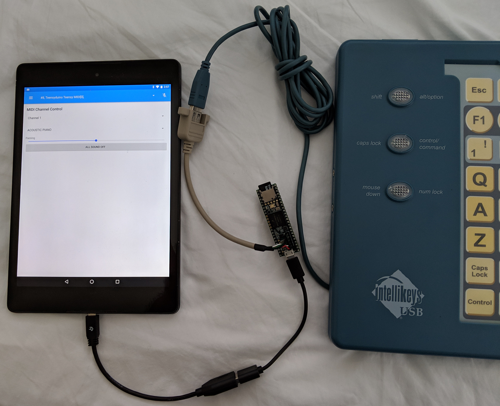

# IntelliKeys_t36
IntelliKeys USB library for the Teensy 3.6 USB host library

Demonstrate the use of the [Teensy
3.6](https://www.pjrc.com/store/teensy36.html) IntelliKeys (IK) USB host
driver. Translate IK touch and switch events into USB keyboard and mouse
actions. The Teensy 3.6 has one USB host port and one USB device port so it
plugs in between the IK and the computer.

For example, when the IK 'A' key is pressed, the computer receives a USB
keyboard 'A'. As far as the computer knows, it is connected to a USB keyboard
and mouse composite device. For debugging, USB serial is also included. USB
joystick is just along for the ride.

The modifier keys (SHIFT, CTRL, ALT, CMD) work in latching mode. Pressing and
releasing the SHIFT key followed by pressing the 'A' key sends a capital 'A'
to the computer. Pressing and releasing the SHIFT key twice in a row turns on
the SHIFT lock. All keys are shifted until the SHIFT key is is pressed and
released one more time. The other modifier keys work the same way.

The lower right corner mouse pad sends USB mouse actions but is not fully
implemented.

The two audio jacks on the left side are for Assistive Technology switches.
Switch 1 opens Chrome to Google on Linux systems. See the example for how it
does this.

The On/Off switch at the top resets the board if it behaves strangely. It does
not control power to the board.

The 8051 firmware is extracted from the
[OpenIKeys](https://github.com/ATMakersOrg/OpenIKeys) project.

The IK EEPROM holds the device serial number. Use the onSerialNum function to
get the serial number. See the example for details. The EEPROM also holds
calibration values for the overlay sensors.

The get_correct, onCorrectMembrane, onCorrectSwitch, and onCorrectDone
functions report the current state of the IK. When the get_correct function is
called, the IK sends back active membrane and switch states. This is useful if
the sketch gets out of sync with the IK. onCorrectMembrane and onCorrectSwitch
will report the current state. The sketch may also call get_correct
periodically to ensure it always knows the current state of the board.

## Hardware components

* PJRC [Teensy 3.6](https://www.pjrc.com/store/teensy36.html)
* PJRC [USB host cable](https://www.pjrc.com/store/cable_usb_host_t36.html)

The Teensy 3.6 is used because it has two USB ports so it can act as a USB
translator.

Note only the 5 pin header for the USB host cable must be soldered on. All the
other pins are not used so there is no need to solder on the other headers.
The micro SD card slot may be used later to load tables mapping touch locations
to keyboard and mouse actions. This will allow the mapping to be changed
without using the Arduino IDE to rebuild the code.

## Development environment

* Install Arduino IDE 1.8.8. Download and follow the instructions at arduino.cc.
* Install Teenysduino 1.45. Download and follow the instructions at pjrc.com.
* Install this library in the Arduino library directory.
* Build and upload the example included with this library. Set the Board to
Teensy 3.6 and the USB Type to "Serial + Keyboard + Mouse + Joystick".

## Other examples

### ik_midi

Turn an IK into an 88 key MIDI keyboard. Instead of keyboard and mouse, the IK
appears as a USB MIDI keyboard. The result is not a substitute for a real
MIDI keyboard but it can be used to play notes one at a time.

This was tested using an Android tablet with a USB OTG to host cable and
FluidSynth. FluidSynth MIDI Synthesizer is a free download from Google Play.

The top left corner corresponds to the left most piano key. This plays MIDI
note 21 also known as note A0 also known as note A, octave 0 also known as
frequency 27.5 Hertz.

In the Arduino IDE, set the USB Type to MIDI. Do not use Serial + MIDI because
this does not work on Android.

## TODO

* Load tables from micro SD card
* ~~CORRECT operations?~~
* ~~EEPROM operations?~~
* ~~Modify onSensors so it returns 0 or 1 instead of raw sensor values. Use
  the EEPROM calibration values.~~
